Good afternoon, all. I apologize if this email ends up being somewhat long; there is a lot of interesting stuff to cover! There will be lots of pretty pictures, I promise.

First, let me remind you of the behavior that I am trying to reproduce (albeit, in a slightly different setting). From Spigler et. al. 2019 "A jamming transition...",

> Main results: Overall, our analysis supports that for smooth activation functions, there exists a constant C0 such that:
>
> - there is a transition for $N_*(P) \leq P/C_0$ below which the training loss converges to some non-zero value (under-parametrized phase) and above which it becomes null (over-parametrized phase).
>
> -  At the transition, the fraction $N_\delta/N$ of unsatisfied constraints per degree of freedom jumps discontinuously to a finite value satisfying $C_0 \leq N_\Delta/N \leq 1$

Here is their figure corresponding to this result:

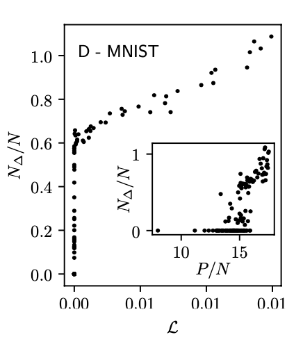

If you recall from the last time that I shared my results, I was able to find the transition from zero to finite training loss as I change $P/N$ (which also corresponded to a cusp in testing loss!), but I was not able to recover the discontinuous jump in $N_\Delta/N$ when plotted against $P/N$.

Since I have been analyzing a random features model (in this case, using the activations of an untrained, single-layer network as features) rather than an end-to-end trained network as was considered in the Spigler paper, this led to the hypothesis that the discontinuous behavior is a property of feature learning.

The experiment that I decided to do consisted of training a two layer (one hidden and one output) network with the hinge loss, using the hidden-layer activations of the partially trained network at several times during training as features for an SVM with near-zero regularization (which is just an efficient approach to building a linear model with the hinge loss). The hope was that the discontinuous jump I am looking for would become more and more pronounced throughout training.

Right away, I foresaw one big issue. When the network is at initialization, the number of free parameters is equal to the width of the hidden layer, since the SVM is the only thing being trained. By the end of training, on the other hand, we should probably include the network weights in that count. If $N$ is the width of the network and d is the input dimensionality (20 in my case), this means that the effective number of parameters is N at the beginning and $(d+1)N$ at the end. To check this intuition, I plotted test loss as a function of $P/N$ at different times in the training process. You can see that the value of $P/N$ at which there is a cusp increases from roughly $1\times10^1$ at initialization to roughly $3\times10^2$ at the end, suggesting that the number of "effective" parameters grows in approximately the same way. Here is a scatterplot at all values of the training time and then a second plot showing sub-sampled times with added lines for greater visual clarity:

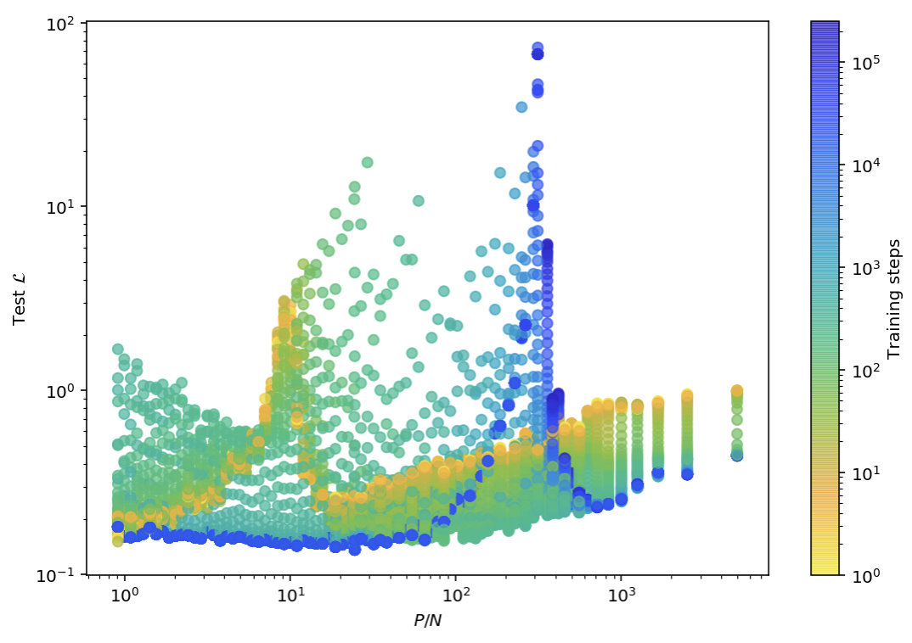
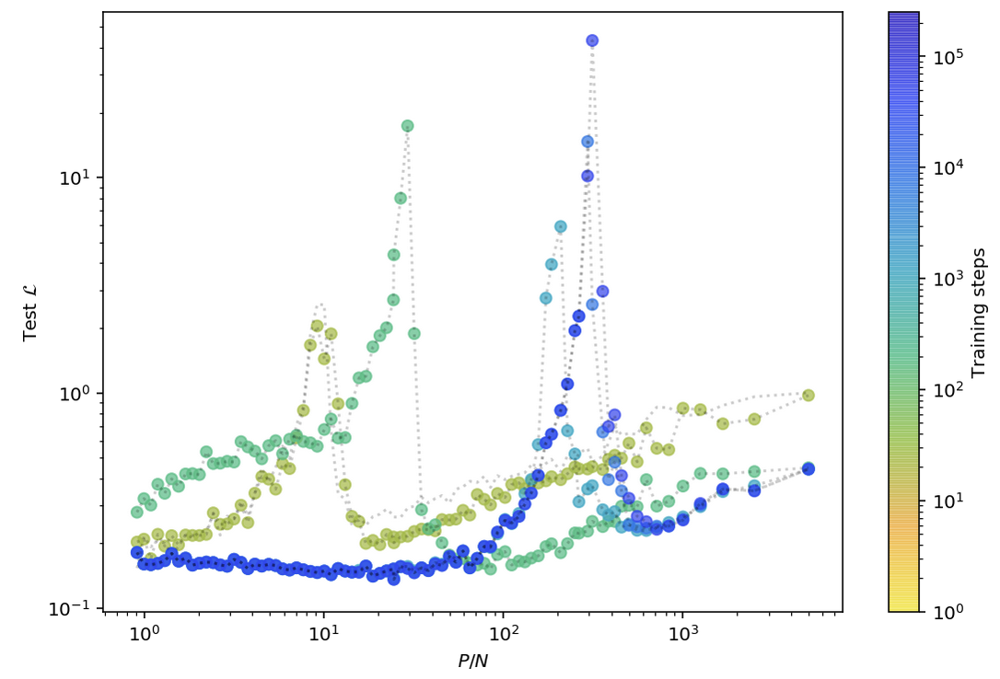

Here is a similar plot, this time showing train loss instead. We can really clearly see the sharp transition from zero to finite loss, which is co-occurs with the test cusp (I need to make some plots that demonstrate this more clearly, but I also need to avoid too much visual clutter..):

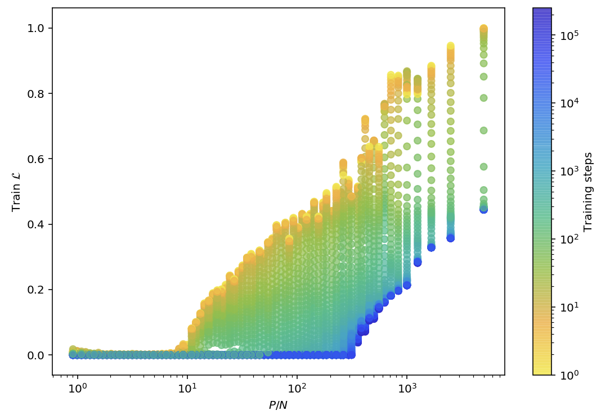

So far, I feel I have a decent grasp on what is happening, and I think that these graphs line up with my expectations fairly well. That starts to break down a bit from here!

First, let's take a look at the training loss against $N_\Delta/N$, where I should remind you that N_del is the number of training data on or on the wrong side of the decision boundary:

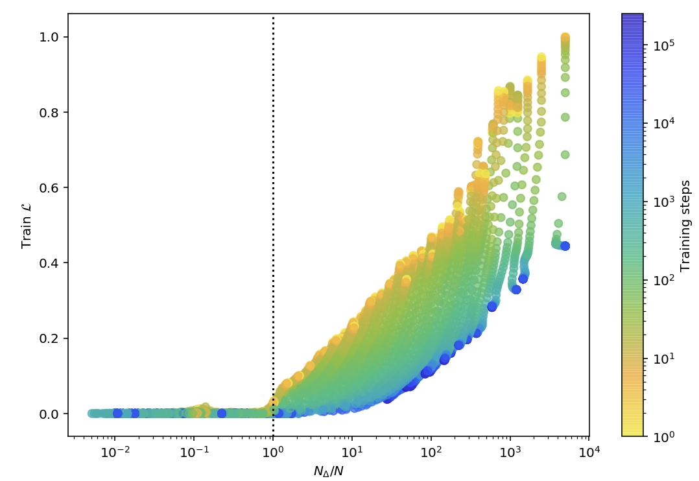

Surprisingly, the transition is sharpest at initialization. This seems a bit counter to the sharp kink seen in the Spigler figure I included above. Perhaps even *more* surprisingly, the transition seems to occur for $N_\Delta/N = 1$, regardless of the number of training steps. This can be a bit more clearly seen when I put the loss on a logarithmic scale:

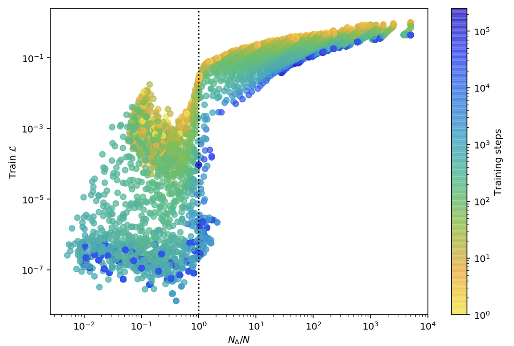

We can get another view on this phenomenon by plotting the test loss instead. Here it is for all values of the # of training steps:

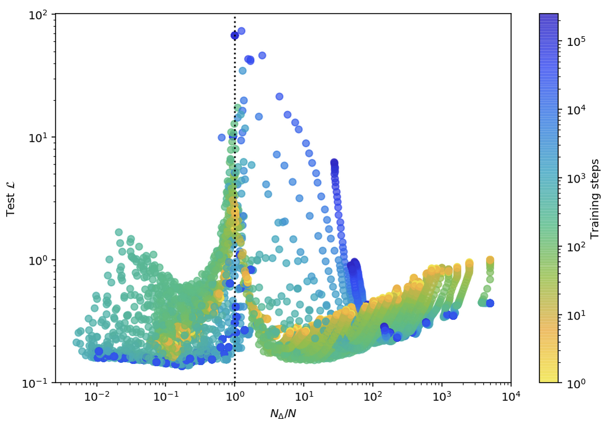

Just those with training steps $< 10^3$:

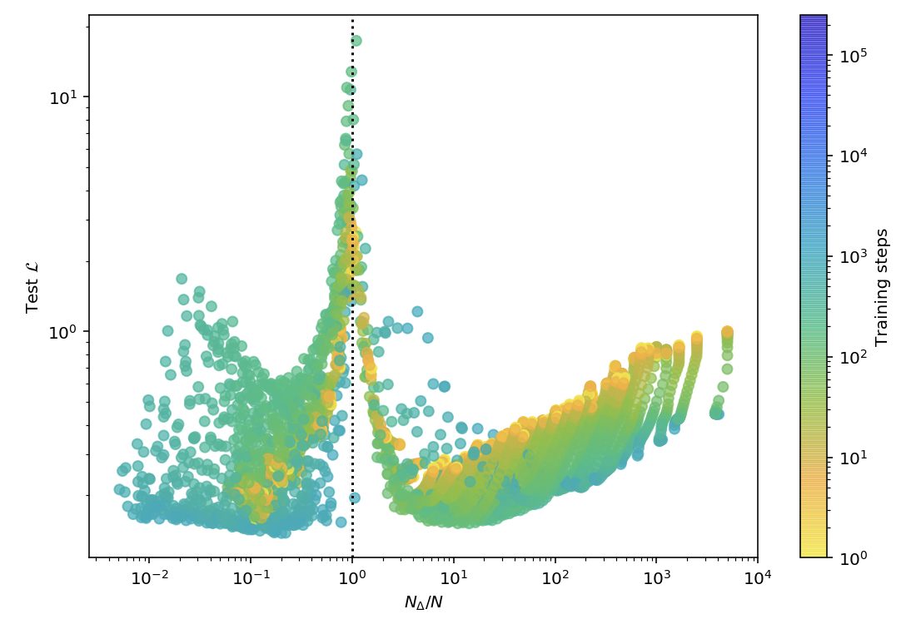

steps $> 10^3$:

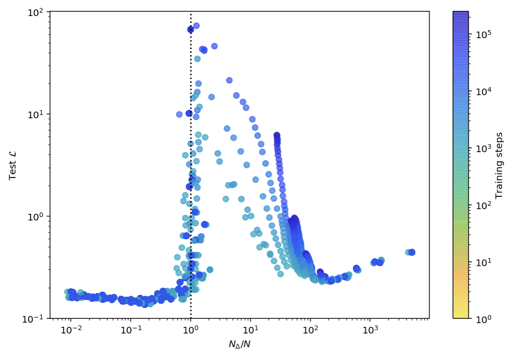

steps $= 10^6$:

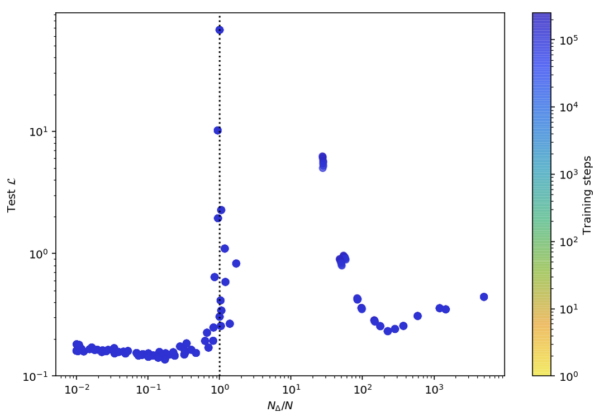

We can see that the test cusp is pretty clearly fixed at $N_\Delta/N = 1$ throughout training, just as we saw with the training loss. This is definitely surprising since the cusp as a function of P/N clearly depended on the number of training steps (which I hypothesized we would see as the effective number of parameters increased).

Something else we can see from these plots--in particular the ones at later points in the training process--is the emergence of a discontinuity in $N_\Delta/N$. Strangely, this is not a jump from $N_\Delta/N = 0$ to a value $\leq1$ as predicted by Spigler et. al.; it is actually a jump from $N_\Delta/N = 1$ to a larger value.

Now, let's take a look at $P/N$ vs $N_\Delta/N$ to see if we can see this discontinuity a bit better. Note that this is a log-log plot since it was the only scale that made any visual sense. Here I will again show it for all values of the # of training set and a sub-sampled set of values for visual clarity:

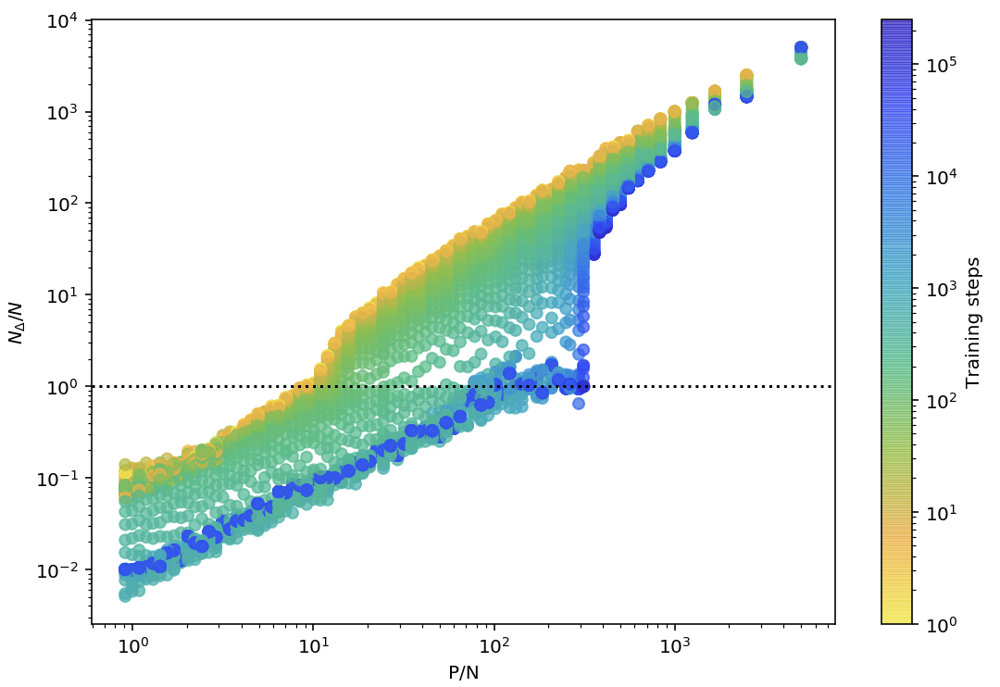
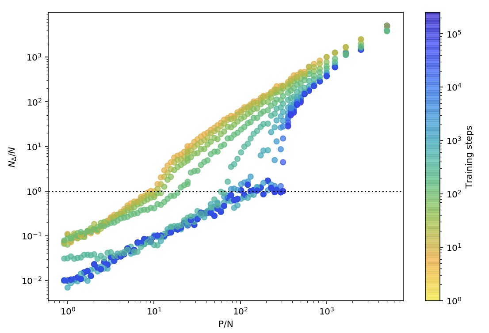

It is very clear that there is a discontinuity forming at longer training times! Another interesting feature is that $N_\Delta/N$ is stationary around 1 for quite a large range of values of P/N below the transition.

It is quite weird that the discontinuity here does not seem to match up with the one found in Spigler et. al. in that it is from $N_\Delta/N$ = 1 to a value > 1 rather than $N_\Delta/N = 0$ to a value $\leq 1$. I have two thoughts about this:

   - I feel that I should check which behavior I observe for the outputs of the network trained to completion (rather than training an SVM on the corresponding hidden activations, I can just use the full model) in order to endure that I am not introducing non-trivial behavior by using a small but finite amount of regularization ($1\times10^{-13}$ -- really, really small...)

   - I am curious if the difference here is due to the fact that the transition scales with the effective number of parameters $N_{eff}$ in $P/N$ space, but it is fixed in $N_\Delta/N$ space. Look what happens when I add a horizontal line to the plot at $(d+1)=21$, which should be the multiplicative factor giving the number of effective parameters at the end of training:

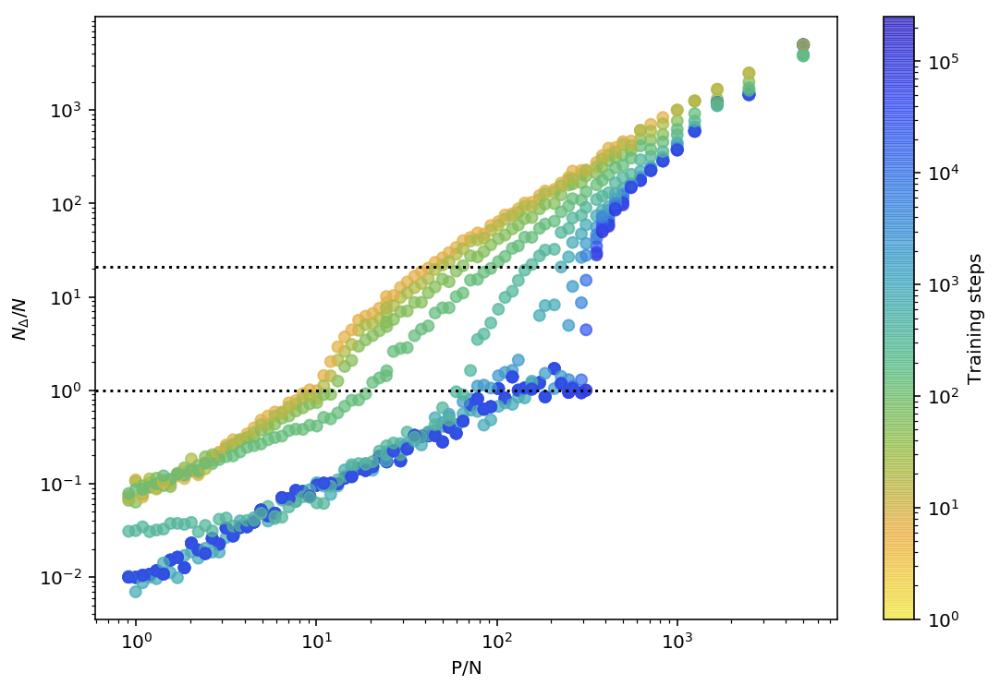

If we re-normalized $N \rightarrow 21N$, the jump for the very well-trained network would appear to be from approximately $1/21$ to $1$, which more closely resembles the jump that Spigler et. al. describes. Can either of you think of an effective way for me to test this hypothesis? Simply repeating this procedure for different values of the embedding dimension d? Alternatively, I could try a deeper network, using the last layer as features. If the width of each layer was N, then the number of effective parameters at the end of training would be $O(N^2)$ rather than $O(Nd)$, causing the scaling to be $O(1/N)$ if that is indeed the mechanism at play (I will take a closer look at the literature in the meantime to see if such an argument is made there).

I was originally thinking that I could get around this re-scaling problem by using NTK features instead of intermediate activations, but I am second-guessing that idea now. Gradients later in training have no reason to work as features for a linear model because they do not correspond to a Taylor expansion around initialization. One other approach I could take would be to train many networks to completion at various values of $P/N$ and various values of the parameter $\alpha$ in Geiger et. al. 2020, "Disentangling..." which allows one to control whether the network does feature learning or not. I think this would be supplementary to the work I have already done here, especially since it is already so late in the game.

Sorry for the long email! I am hoping the large number of pretty pictures has encouraged you along to the end (after all, they did substantially contribute to the length of the email). I look forward to discussing this on Thursday!
Thank you for your time.

Kind regards,
Hudson
